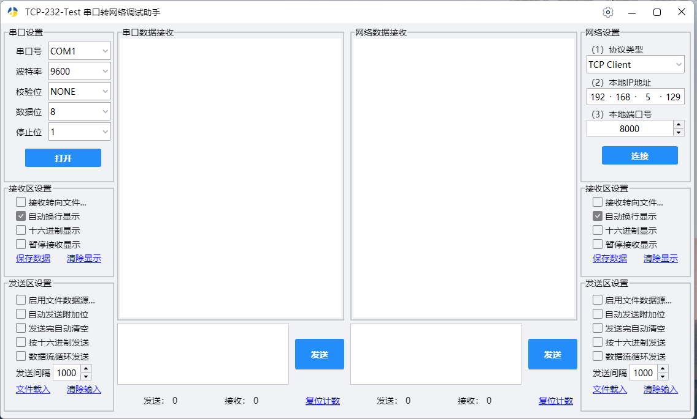
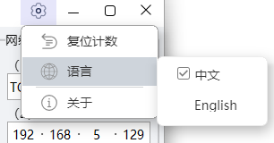
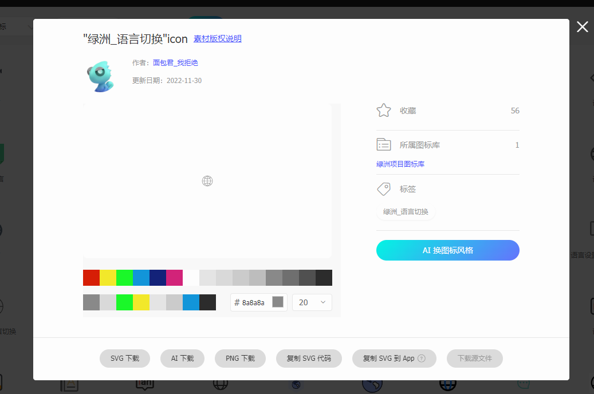

# TCP,RS232 测试工具

项目介绍
--------

`调试RS232，TCP，UDP接收发送数据。`

## 程序界面

## 引用3rdParty

1. [nim_duilib](https://github.com/rhett-lee/nim_duilib.git) 
2. [POCO](https://github.com/pocoproject/poco.git) 
3. [spdlog](https://github.com/gabime/spdlog.git)
4. [gflags](https://github.com/gflags/gflags.git)
5. [serial](https://github.com/wjwwood/serial.git)
   

## 开发环境

1.  操作系统：Windows 10
2.  开发工具：VS2022
3.  编译的lib 运行库“MT/MTD”
4.  CMake 3.25
5.  编译器C++ 20
6.  字符集 Unicode 

## 开发文档

1. [POCO](https://docs.pocoproject.org/)

## 菜单图标尺寸、颜色

`颜色：#8a8a8a，尺寸：20x20`

